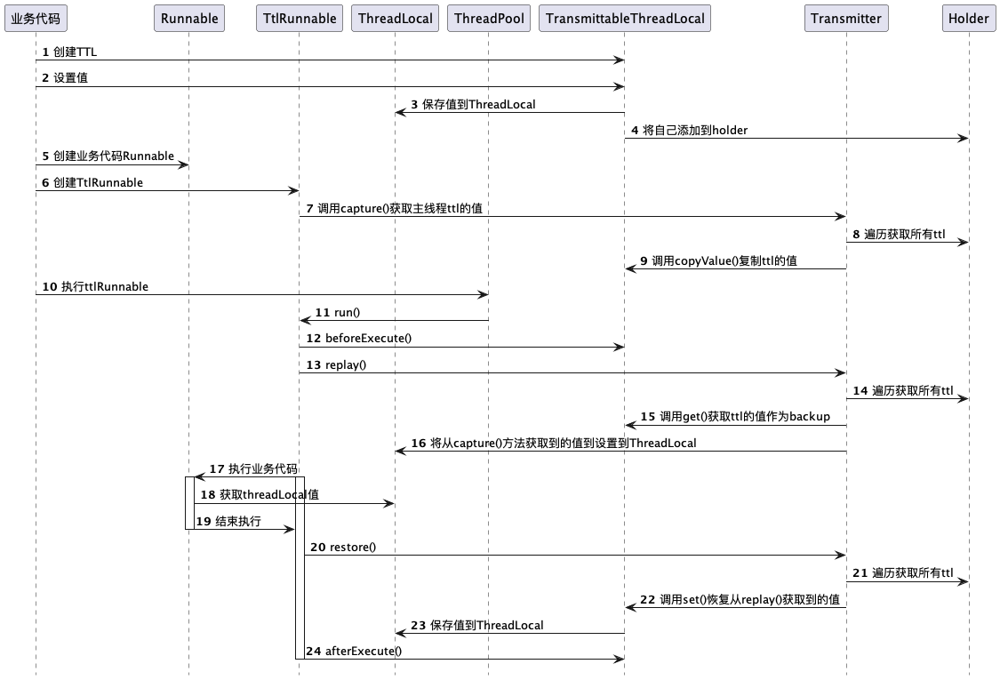

== 要解决的问题

TransmittableThreadLocal(下面简称TTL)继承自JDK的ThreadLocal，用于解决InheritableThreadLocal在线程池的场景下，由于线程复用导致子线程只能获取到创建的那一时刻父线程中ThreadLocal的值，如下面的例子：

[source, java]
----
public class Demo {
    @Test
    public void testInheritableThreadLocal() throws InterruptedException {
        ThreadLocal<String> threadLocal = new InheritableThreadLocal<>();
        threadLocal.set(UUID.randomUUID().toString().replace("-", ""));
        System.out.println("主线程打印————" + Thread.currentThread().getName() + "：" + threadLocal.get());
        new Thread(new Runnable() {
            @Override
            public void run() {
                System.out.println("子线程打印————" + Thread.currentThread().getName() + "："+ threadLocal.get());
            }
        }).start();

        ExecutorService executorService = Executors.newFixedThreadPool(2);

        for (int i = 0; i < 4; i++) {
            executorService.execute(() -> {
                System.out.println("线程池打印————"+Thread.currentThread().getName()+"：" + threadLocal.get());
            });
        }

        Thread.sleep(3000L);
        System.out.println("主线程修改ThreadLocal的值");
        threadLocal.remove();
        threadLocal.set(UUID.randomUUID().toString().replace("-", ""));
        System.out.println("主线程打印————" + Thread.currentThread().getName() + "：" + threadLocal.get());
        new Thread(new Runnable() {
            @Override
            public void run() {
                System.out.println("子线程打印————" + Thread.currentThread().getName() + "："+ threadLocal.get());
            }
        }).start();
        try {
            for (int i = 0; i < 4; i++) {
                executorService.execute(() -> {
                    System.out.println("线程池打印————"+Thread.currentThread().getName()+"：" + threadLocal.get());
                });
            }
        } finally {
            executorService.shutdown();
        }
    }
}

/*
输出：
主线程打印————main：f88d97208ff84773b323bc277a34c0c1
子线程打印————Thread-0：f88d97208ff84773b323bc277a34c0c1
线程池打印————pool-1-thread-1：f88d97208ff84773b323bc277a34c0c1
线程池打印————pool-1-thread-1：f88d97208ff84773b323bc277a34c0c1
线程池打印————pool-1-thread-1：f88d97208ff84773b323bc277a34c0c1
线程池打印————pool-1-thread-2：f88d97208ff84773b323bc277a34c0c1
主线程修改ThreadLocal的值
主线程打印————main：d74bb2d9e1da4b14a01ffae541ddd983
子线程打印————Thread-1：d74bb2d9e1da4b14a01ffae541ddd983
线程池打印————pool-1-thread-1：f88d97208ff84773b323bc277a34c0c1
线程池打印————pool-1-thread-2：f88d97208ff84773b323bc277a34c0c1
线程池打印————pool-1-thread-2：f88d97208ff84773b323bc277a34c0c1
线程池打印————pool-1-thread-1：f88d97208ff84773b323bc277a34c0c1
 */
----

可以看到InheritableThreadLocal解决了子线程获取主线程ThreadLocal的问题，但是当主线程更新ThreadLocal的值后，线程池中被复用的线程拿到的还是更新前的值，这是因为InheritableThreadLocal的实现机制是在线程创建的时候获取主线程中ThreadLocal的值，在之后就没有获取的机会了。

TTL的实现本质上就是将获取主线程ThreadLocal的值从线程创建的那一时刻，改成在创建任务的时候获取，并在子线程执行任务时将获取到的值更新到子线程的ThreadLocal，核心逻辑可以用下面的例子理解：

[source,java]
----
public class SimpleTransmittableThreadLocal {
    public static class SimpleThreadLocal {
        private static final ThreadLocal<Map<String, Object>> copyOnThreadLocal = new ThreadLocal<>();

        public static Map<String, Object> get() {
            return copyOnThreadLocal.get();
        }

        public static void put(Map<String, Object> val) {
            copyOnThreadLocal.set(val);
        }

        public static void remove() {
            copyOnThreadLocal.remove();
        }
    }

    public static class SimpleRunnable implements Runnable {

        private final Runnable runnable;
        private static Map<String, Object> threadLocal;

        public SimpleRunnable(Runnable runnable) {
            this.runnable = runnable;
            threadLocal = SimpleThreadLocal.get();
        }

        @Override
        public void run() {
            SimpleThreadLocal.put(threadLocal);
            runnable.run();
            SimpleThreadLocal.remove();
        }
    }

    @Test
    public void testSimpleThreadLocal() throws InterruptedException {
        Map<String, Object> map = new HashMap<>();
        map.put("UUID", UUID.randomUUID().toString().replace("-", ""));
        SimpleThreadLocal.put(map);
        System.out.println("主线程打印————" + Thread.currentThread().getName() + "：" + SimpleThreadLocal.get().get("UUID"));

        ExecutorService executorService = Executors.newFixedThreadPool(2);

        for (int i = 0; i < 4; i++) {
            executorService.execute(new SimpleRunnable(new Runnable() {
                @Override
                public void run() {
                    System.out.println(
                            "线程池打印————" + Thread.currentThread().getName() + "：" + SimpleThreadLocal.get().get("UUID"));
                }
            }));
        }

        Thread.sleep(3000L);
        System.out.println("主线程修改ThreadLocal的值");
        map = new HashMap<>();
        map.put("UUID", UUID.randomUUID().toString().replace("-", ""));
        SimpleThreadLocal.put(map);
        System.out.println("主线程打印————" + Thread.currentThread().getName() + "：" + SimpleThreadLocal.get().get("UUID"));
        try {
            for (int i = 0; i < 4; i++) {
                executorService.execute(new SimpleRunnable(new Runnable() {
                    @Override
                    public void run() {
                        System.out.println(
                                "线程池打印————" + Thread.currentThread().getName() + "：" + SimpleThreadLocal.get()
                                        .get("UUID"));
                    }
                }));
            }
        } finally {
            executorService.shutdown();
        }
    }
}
/*
输出：
主线程打印————main：22c5c986fbd647fb896f30d20e11c99b
线程池打印————pool-1-thread-1：22c5c986fbd647fb896f30d20e11c99b
线程池打印————pool-1-thread-2：22c5c986fbd647fb896f30d20e11c99b
线程池打印————pool-1-thread-1：22c5c986fbd647fb896f30d20e11c99b
线程池打印————pool-1-thread-2：22c5c986fbd647fb896f30d20e11c99b
主线程修改ThreadLocal的值
主线程打印————main：495ea40b552e48d59279ee2b7e32c5a0
线程池打印————pool-1-thread-1：495ea40b552e48d59279ee2b7e32c5a0
线程池打印————pool-1-thread-2：495ea40b552e48d59279ee2b7e32c5a0
线程池打印————pool-1-thread-2：495ea40b552e48d59279ee2b7e32c5a0
线程池打印————pool-1-thread-1：495ea40b552e48d59279ee2b7e32c5a0
 */
----

可以看到主线程修改ThreadLocal的值后，线程池中被复用的线程可以获取到修改后的值，这是因为通过SimpleRunnable这个包装类，在创建任务时保存了主线程ThreadLocal的值，并在run方法中将值更新到子线程的ThreadLocal。

TTL的实现也是这个思路，只是处理了一些细节，提供了一些扩展，下面看看TTL的实现。

== TTL的实现
TTL提供了两种使用方式：

=== 修饰Runnable和Callable
.通过TtlRunnable工具类修饰Runnable和Callable
[source, java]
----
public class MyDemo {
    private static final TransmittableThreadLocal<String> context = new TransmittableThreadLocal<>();

    @Test
    public void testTtlRunnable() throws InterruptedException {
        ExecutorService executorService = Executors.newSingleThreadExecutor();
        Runnable task = new RunnableTask();

        // 在父线程中设置
        context.set("init-value");
        executorService.submit(TtlRunnable.get(task));

        // 在父线程中设置
        context.set("value-set-in-parent");
        executorService.submit(TtlRunnable.get(task));
        executorService.awaitTermination(10, TimeUnit.SECONDS);
    }

    public static class RunnableTask implements Runnable {
        @Override
        public void run() {
            try {
                TimeUnit.SECONDS.sleep(1);
            } catch (InterruptedException e) {
                e.printStackTrace();
            }
            System.out.println(context.get());
        }
    }
}

/*
输出：
init-value
value-set-in-parent
 */
----

=== 修饰线程池
.通过TtlExecutors工具类修饰线程池
[source, java]
----
public class MyDemo {
    private static final TransmittableThreadLocal<String> context = new TransmittableThreadLocal<>();

    @Test
    public void testTtlExecutors() throws InterruptedException {
        ExecutorService executorService = Executors.newSingleThreadExecutor();
        executorService = TtlExecutors.getTtlExecutorService(executorService);
        Runnable task = new RunnableTask();

        // 在父线程中设置
        context.set("init-value");
        executorService.submit(task);

        // 在父线程中设置
        context.set("value-set-in-parent");
        executorService.submit(task);
        executorService.awaitTermination(10, TimeUnit.SECONDS);
    }

    public static class RunnableTask implements Runnable {
        @Override
        public void run() {
            try {
                TimeUnit.SECONDS.sleep(1);
            } catch (InterruptedException e) {
                e.printStackTrace();
            }
            System.out.println(context.get());
        }
    }
}

/*
输出：
init-value
value-set-in-parent
 */
----

修饰线程池的方式本质上和修饰Runnable和Callable是一样的，TtlExecutors使用装饰器模式将提交到线程池的Runnable和Callable通过TtlRunnable进行修饰，下面就看看TtlRunnable的实现。

=== 实现
==== 使用TTL整个过程的时序图

TtlRunnable类的核心代码在其构造函数和run方法：

[source, java]
----
public final class TtlRunnable implements Runnable, TtlWrapper<Runnable>, TtlEnhanced, TtlAttachments {
    private final AtomicReference<Object> capturedRef;
    private final Runnable runnable;
    private final boolean releaseTtlValueReferenceAfterRun;

    private TtlRunnable(@NonNull Runnable runnable, boolean releaseTtlValueReferenceAfterRun) {
        this.capturedRef = new AtomicReference<>(capture());
        this.runnable = runnable;
        this.releaseTtlValueReferenceAfterRun = releaseTtlValueReferenceAfterRun;
    }

    @Override
    public void run() {
        final Object captured = capturedRef.get();
        if (captured == null || releaseTtlValueReferenceAfterRun && !capturedRef.compareAndSet(captured, null)) {
            throw new IllegalStateException("TTL value reference is released after run!");
        }

        final Object backup = replay(captured);
        try {
            runnable.run();
        } finally {
            restore(backup);
        }
    }
}
----

TtlRunnable的构造函数会调用Transmitter的capture()方法：
----
@NonNull
public static Object capture() {
    final HashMap<Transmittee<Object, Object>, Object> transmittee2Value = new HashMap<>(transmitteeSet.size());
    for (Transmittee<Object, Object> transmittee : transmitteeSet) {
        try {
            transmittee2Value.put(transmittee, transmittee.capture());
        } catch (Throwable t) {
            if (logger.isLoggable(Level.WARNING)) {
                logger.log(Level.WARNING, "exception when Transmitter.capture for transmittee " + transmittee +
"(class " + transmittee.getClass().getName() + "), just ignored; cause: " + t, t);
            }
        }
    }
    // Snapshot只是持有transmittee2Value
    return new Snapshot(transmittee2Value);
}
----

capture()方法遍历transmitteeSet中的Transmittee对象（注意这里是Transmittee类而不是Transmitter类）并调用其capture()方法，而transmitteeSet的初始化代码如下：

----
// 下面的registerTransmittee方法会把ttlTransmittee和threadLocalTransmittee添加到transmitteeSet中
private static final Set<Transmittee<Object, Object>> transmitteeSet = new CopyOnWriteArraySet<>();

static {
    registerTransmittee(ttlTransmittee);
    registerTransmittee(threadLocalTransmittee);
}

// Transmittee接口定义，C表示被捕获的值类型，B表示backup的值类型
public interface Transmittee<C, B> {
    // 捕获
    C capture();

    // 备份
    B replay(@NonNull C captured);

    // 等价于replay(EMPTY_CAPTURE)，清空Transmittee的值并返回backup
    B clear();

    // 根据backup的值进行恢复
    void restore(@NonNull B backup);
}
----

ttlTransmittee和threadLocalTransmittee会被添加到transmitteeSet中，而Transmitter类的capture()方法会遍历transmitteeSet中的Transmittee对象，逐个执行Transmittee对象的capture()方法，这里需要注意区分Transmitter类和Transmittee类，Transmitter类的作用是作为一个静态工具类，遍历transmitteeSet中的Transmittee对象，帮助TtlRunnable完成后面说到的CRR模式，Transmitter类的实现在下面会分析。

Transmittee接口定义了transmittable-thread-local的README中说到的link:docs/developer-guide.md[**_`CRR(capture/replay/restore)`模式_**]：

1. capture方法：抓取线程（线程A）的所有TTL值。
2. replay方法：在另一个线程（线程B）中，回放在capture方法中抓取的TTL值，并返回回放前TTL值的备份
3. restore方法：恢复线程B执行replay方法之前的TTL值（即备份）

ttl的核心就是CRR的过程，下面看看CRR的过程是怎么实现的，首先是前面提到的capture()，该方法的实现首先是在Transmitter类中，代码如下：
----
@NonNull
public static Object capture() {
    final HashMap<Transmittee<Object, Object>, Object> transmittee2Value = new HashMap<>(transmitteeSet.size());
    for (Transmittee<Object, Object> transmittee : transmitteeSet) {
        try {
            transmittee2Value.put(transmittee, transmittee.capture());
        } catch (Throwable t) {
            if (logger.isLoggable(Level.WARNING)) {
                logger.log(Level.WARNING, "exception when Transmitter.capture for transmittee " + transmittee +
                        "(class " + transmittee.getClass().getName() + "), just ignored; cause: " + t, t);
            }
        }
    }
    // Snapshot只是持有transmittee2Value
    return new Snapshot(transmittee2Value);
}
----

Transmitter类的capture()方法遍历transmitteeSet中的ttlTransmittee和threadLocalTransmittee这两个Transmittee实现类。分别调用其capture()方法并保存到map，最终map会被封装到Snapshot对象作为TtlRunnable对象的captured属性，用于之后的replay过程。

transmitteeSet中的ttlTransmittee是TransmittableThreadLocal实现CRR的核心，threadLocalTransmittee的作用是支持注册自定义的ThreadLocal，使其具备和TransmittableThreadLocal一样的能力，原理和ttlTransmittee是一样的，所以下面主要看ttlTransmittee的实现，ttlTransmittee中capture()的实现
----
@NonNull
@Override
public HashMap<TransmittableThreadLocal<Object>, Object> capture() {
// 拷贝一份holder中的数据并返回，holder中保存了所有的TransmittableThreadLocal
final HashMap<TransmittableThreadLocal<Object>, Object> ttl2Value = new HashMap<>(holder.get().size());
    for (TransmittableThreadLocal<Object> threadLocal : holder.get().keySet()) {
        ttl2Value.put(threadLocal, threadLocal.copyValue());
    }
    return ttl2Value;
}
----
ttlTransmittee的capture()方法遍历holder获取ttl对象并调用copyValue方法复制ttl对象的值，copyValue()方法默认实现是直接返回ttl的值，可以通过
ttl的子类SuppliedTransmittableThreadLocal重写copyValue()方法的实现。最终capture()方法会返回一个以holder中所有ttl为key，ttl的copyValue为value的Map。

holder中的ttl对象又是哪来的呢？可以看ttl的get()和set()方法的实现：
----
@Override
public final T get() {
    T value = super.get();
    if (disableIgnoreNullValueSemantics || null != value) addThisToHolder();
    return value;
}

@Override
public final void set(T value) {
    if (!disableIgnoreNullValueSemantics && null == value) {
        // may set null to remove value
        remove();
    } else {
        super.set(value);
        addThisToHolder();
    }
}
----

ttl的get()和set()方法在被调用后，都会执行addThisToHolder()方法，将ttl自己添加到holder中，holder的定义和该方法的实现如下：
----
private static final InheritableThreadLocal<WeakHashMap<TransmittableThreadLocal<Object>, ?>> holder =
        new InheritableThreadLocal<WeakHashMap<TransmittableThreadLocal<Object>, ?>>() {
            @Override
            protected WeakHashMap<TransmittableThreadLocal<Object>, ?> initialValue() {
                return new WeakHashMap<>();
            }

            @Override
            protected WeakHashMap<TransmittableThreadLocal<Object>, ?> childValue(WeakHashMap<TransmittableThreadLocal<Object>, ?> parentValue) {
                return new WeakHashMap<TransmittableThreadLocal<Object>, Object>(parentValue);
            }
        };

private void addThisToHolder() {
    if (!holder.get().containsKey(this)) {
        // holder只是为了引用所有的TransmittableThreadLocal，value为null可以在TransmittableThreadLocal不被业务代码强引用
        // 的时候进行内存回收
        holder.get().put((TransmittableThreadLocal<Object>) this, null); // WeakHashMap supports null value.
    }
}
----

holder是一个InheritableThreadLocal对象，持有WeakHashMap。从ttl的时序图可以看到，每个ttl对象在主线程get/set，这些ttl对象在get/set时都将自己添加到holder作为key，这样主线程的holder对象就持有了所有ttl的引用。TtlRunnable类的构造函数是在主线程执行的，并调用了capture()方法遍历holder中所有的ttl对象，从而实现了在创建TtlRunnable对象时能够获取到主线程所有ttl对象的引用及ttl对象的copyValue。

总结一下CRR模式中的C的作用，在TtlRunnable的构造函数遍历所有主线程中的ttl对象，分别调用copyValue方法并保存到map中，最终保存到TtlRunnable对象的captured属性，也就是捕获主线程所有的ttl对象及ttl对象的copyValue。

CRR模式中第一个R的作用是replay，简单来说是更新子线程ttl的值为C阶段捕获到的主线程的ttl值，其执行的时机是TtlRunnable对象的run()方法，注意TtlRunnable对象的run()方法运行环境已经是子线程了，其代码如下：
----
@Override
public void run() {
    final Object captured = capturedRef.get();
    if (captured == null || releaseTtlValueReferenceAfterRun && !capturedRef.compareAndSet(captured, null)) {
        throw new IllegalStateException("TTL value reference is released after run!");
    }

    final Object backup = replay(captured);
    try {
        runnable.run();
    } finally {
        restore(backup);
    }
}
----

captured对象就是前面说到的Transmitter类的capture()方法返回的Snapshot对象，通过这个Snapshot对象能够获取到ttlTransmittee对象（实际上还有threadLocalTransmittee，原理是一样的，这里就忽略了），及主线程所有ttl对象和ttl的copyValue（实际上只是TtlRunnable对象在创建的那一刻主线程所有的ttl，创建之后主线程新持有的ttl是没有的）。

captured对象作为replay()方法的入参，replay()方法的实现在Transmitter类，代码如下：
----
@NonNull
public static Object replay(@NonNull Object captured) {
    final Snapshot capturedSnapshot = (Snapshot) captured;

    // 这里transmittee2Value的key是transmitteeSet中的元素，value是对应Transmittee的capture返回值
    final HashMap<Transmittee<Object, Object>, Object> transmittee2Value = new HashMap<>(capturedSnapshot.transmittee2Value.size());
    for (Map.Entry<Transmittee<Object, Object>, Object> entry : capturedSnapshot.transmittee2Value.entrySet()) {
        Transmittee<Object, Object> transmittee = entry.getKey();
        try {
            Object transmitteeCaptured = entry.getValue();
            transmittee2Value.put(transmittee, transmittee.replay(transmitteeCaptured));
        } catch (Throwable t) {
            if (logger.isLoggable(Level.WARNING)) {
                logger.log(Level.WARNING, "exception when Transmitter.replay for transmittee " + transmittee +
                        "(class " + transmittee.getClass().getName() + "), just ignored; cause: " + t, t);
            }
        }
    }
    return new Snapshot(transmittee2Value);
}
----

replay()方法遍历captured中的Transmittee对象并分别调用replay()方法，这里主要看ttlTransmittee对象的实现，其replay()方法代码如下：
----
@NonNull
@Override
public HashMap<TransmittableThreadLocal<Object>, Object> replay(@NonNull HashMap<TransmittableThreadLocal<Object>, Object> captured) {
    final HashMap<TransmittableThreadLocal<Object>, Object> backup = new HashMap<>(holder.get().size());

    for (final Iterator<TransmittableThreadLocal<Object>> iterator = holder.get().keySet().iterator(); iterator.hasNext(); ) {
        TransmittableThreadLocal<Object> threadLocal = iterator.next();

        // backup
        // 这里调用的是threadLocal的get方法而不是copy，replay的目的是备份父线程的值，防止业务代码在执行时
        // 修改的threadLocal值在holder中生效
        backup.put(threadLocal, threadLocal.get());

        // clear the TTL values that is not in captured
        // avoid the extra TTL values after replay when run task
        // 上面的backup已经备份了holder中所有的threadLocal，这里在发现当前线程的captured中没有当前的threadLocal
        // 则将其从holder中暂时移除，避免业务代码在执行的时候holder中的threadLocal数量和captured中的threadLocal
        // 数量不一致
        // holder是InheritableThreadLocal类型的，所以可以很安全的remove，并在之后进行restore操作而不影响其他
        // 线程
        if (!captured.containsKey(threadLocal)) {
            iterator.remove();
            threadLocal.superRemove();
        }
    }

    // set TTL values to captured
    // 将captured的值保存到threadlocal中，set进去的value是在capture方法执行时holder中的threadLocal的copyValue
    setTtlValuesTo(captured);

    // call beforeExecute callback
    // 调用所有threadlocal的beforeExecute方法
    doExecuteCallback(true);

    return backup;
}

private static void setTtlValuesTo(@NonNull HashMap<TransmittableThreadLocal<Object>, Object> ttlValues) {
    for (Map.Entry<TransmittableThreadLocal<Object>, Object> entry : ttlValues.entrySet()) {
        TransmittableThreadLocal<Object> threadLocal = entry.getKey();
        threadLocal.set(entry.getValue());
    }
}
----

ttlTransmittee对象的replay()方法首先通过holder遍历父线程持有的所有ttl对象，逐个调用get()方法对父线程中ttl的值进行备份，之后判断当前子线程captured的ttl对象中是否存在主线程中的ttl，不存在的话则从holder中暂时移除该ttl，这是为了避免子线程运行时其captured的ttl数量和holder中ttl的数量不一致。

循环结束后将captured中ttl的值设置到了当前运行的子线程的threadLocal中，并返回主线程holder中的备份，这之后子线程运行业务代码就可以获取到TtlRunnable对象创建的那个时刻获取到的父线程ttl的值。

TtlRunnable的run()方法最后执行restore()对replay()方法获取到的备份进行恢复，代码如下：
----
public static void restore(@NonNull Object backup) {
    for (Map.Entry<Transmittee<Object, Object>, Object> entry : ((Snapshot) backup).transmittee2Value.entrySet()) {
        Transmittee<Object, Object> transmittee = entry.getKey();
        try {
            Object transmitteeBackup = entry.getValue();
            transmittee.restore(transmitteeBackup);
        } catch (Throwable t) {
            if (logger.isLoggable(Level.WARNING)) {
                logger.log(Level.WARNING, "exception when Transmitter.restore for transmittee " + transmittee +
                        "(class " + transmittee.getClass().getName() + "), just ignored; cause: " + t, t);
            }
        }
    }
}
----

参数backup就是前面说到的replay()方法的返回值，包含了更新子线程threadLocal之前主线程holder中所有的ttl对象及ttl的值，恢复备份的过程和replay()方法获取备份的过程类似，主要是将backup中所有的ttl恢复到holder中，ttlTransmittee对象的restore()方法代码实现如下：
----
@Override
public void restore(@NonNull HashMap<TransmittableThreadLocal<Object>, Object> backup) {
    // call afterExecute callback
    // 调用所有threadlocal的afterExecute方法
    doExecuteCallback(false);

    // 这里遍历holder是为了过滤掉在capture方法执行后保存的所有threadLocal中不存在的threadLocal
    // 这些threadLocal可能是业务方法在执行时put到holder的，这里为了保证capture方法执行前和restore
    // 方法执行后holder的threadLocal是一致的
    for (final Iterator<TransmittableThreadLocal<Object>> iterator = holder.get().keySet().iterator(); iterator.hasNext(); ) {
        TransmittableThreadLocal<Object> threadLocal = iterator.next();

        // clear the TTL values that is not in backup
        // avoid the extra TTL values after restore
        if (!backup.containsKey(threadLocal)) {
            iterator.remove();
            threadLocal.superRemove();
        }
    }

    // restore TTL values
    // 将backup的值保存到threadlocal中
    setTtlValuesTo(backup);
}
----
